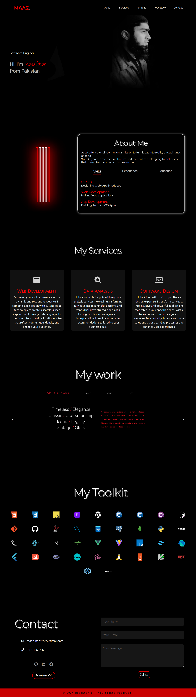

# 💼 Portfolio Website - 1

Welcome to my minimalistic portfolio website! This site is designed with a sleek black and red theme, focusing on simplicity and elegance without unnecessary embellishments.

## ✨ Features

- **Minimalist Design**: A clean and straightforward layout with a black and red color scheme, ensuring your content takes center stage.
- **Responsive Layout**: Optimized for all screen sizes, providing a seamless experience on desktops, tablets, and mobile devices.
- **Working Contact Form**: A functional contact form that submits messages directly to a Google Sheet, making it easy to manage inquiries.
- **Smooth Navigation**: Simple and intuitive navigation for an easy browsing experience.

## 🛠️ Technologies Used

- **HTML5**
- **CSS3**
- **JavaScript**
- **Google Sheets API** (for the contact form integration)

## 📝 License
 This project is licensed under the MIT License. 

## ⚙️ Setup Instructions

To set up this project locally:

 **Clone the repository**:
   ```bash
   git clone https://github.com/your-username/portfolio-website.git
   cd portfolio-website
```

**Assets**: you need to replace four images of different sizes in the assets directory along with logo.png
**Projects**: setup `My Work` section by adding images of your projects and appropraite links and labels
**CV**: place your cv.pdf in the assets folder

## 📧 Setting Up the Contact Form API

Follow these steps to set up the Google Sheets API for the contact form on your portfolio website:

### 1. Create a Google Sheet
- Create a new Google Sheet and name it **"Contact Form"** (or any other name you prefer).

### 2. Access Google Apps Script
- Go to the **Extensions** tab in your Google Sheet.
- Click on **Apps Script** to open the script editor.
- Name the script **"Contact Form"**.

### 3. Add the Script
- Paste the following code into the script editor. This code is adapted from the repository [form-to-google-sheets](https://github.com/jamiewilson/form-to-google-sheets):

  ```javascript
  var sheetName = 'Sheet1'
  var scriptProp = PropertiesService.getScriptProperties()

  function intialSetup () {
    var activeSpreadsheet = SpreadsheetApp.getActiveSpreadsheet()
    scriptProp.setProperty('key', activeSpreadsheet.getId())
  }

  function doPost (e) {
    var lock = LockService.getScriptLock()
    lock.tryLock(10000)

    try {
      var doc = SpreadsheetApp.openById(scriptProp.getProperty('key'))
      var sheet = doc.getSheetByName(sheetName)

      var headers = sheet.getRange(1, 1, 1, sheet.getLastColumn()).getValues()[0]
      var nextRow = sheet.getLastRow() + 1

      var newRow = headers.map(function(header) {
        return header === 'timestamp' ? new Date() : e.parameter[header]
      })

      sheet.getRange(nextRow, 1, 1, newRow.length).setValues([newRow])

      return ContentService
        .createTextOutput(JSON.stringify({ 'result': 'success', 'row': nextRow }))
        .setMimeType(ContentService.MimeType.JSON)
    }

    catch (e) {
      return ContentService
        .createTextOutput(JSON.stringify({ 'result': 'error', 'error': e }))
        .setMimeType(ContentService.MimeType.JSON)
    }

    finally {
      lock.releaseLock()
    }
  }
  ```
### 4. Run the Script
- Run the script for the first time by selecting the intialSetup function.
- You will be prompted to authorize the script to access your Google account. Complete the authorization process.

### 5. Deploy as a Web App
- After the script runs successfully, click on Deployment > New deployment.
- Choose the type as Web app.
- Configure the deployment settings, ensuring that:
  - Execute as: Me
  - Who has access: Anyone
- Deploy the web app.

### 6. Use the Web App URL
- After deployment is complete, you will receive a link to the web app.
- Copy this link and use it as the 'SCRIPT URL' in your contact form's JavaScript code to enable form submissions.

Your contact form is now set up and ready to receive messages, which will be saved directly to your Google Sheet!


## 📸 Screenshots

### desktop view


### mobile view


